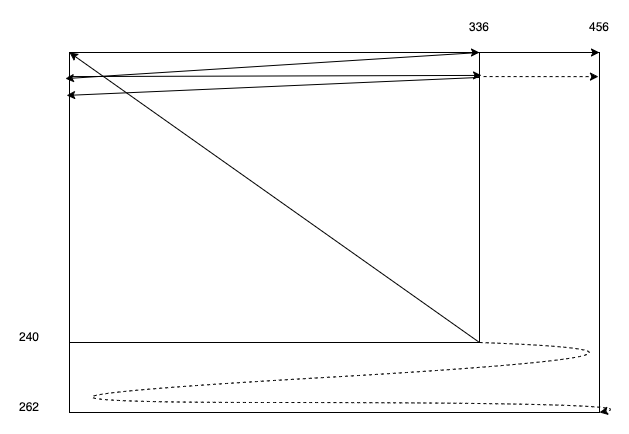
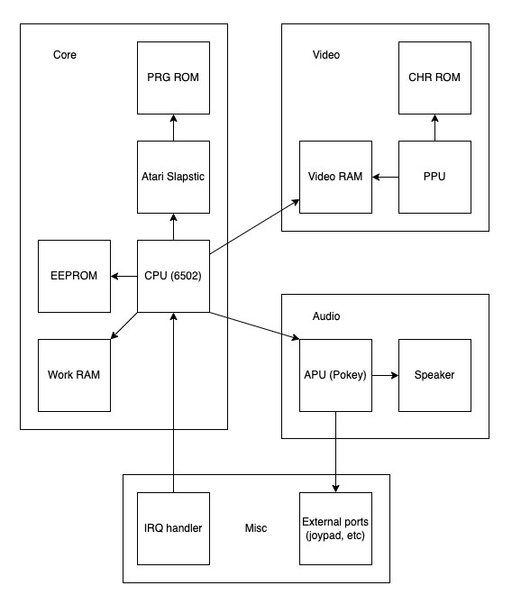

# The architecture of the system

A system, at least from the perspective of emulating old games/consoles, can be thought of as being composed of the following 3 important components. In Atari Tetris' case:
- **CPU (Central processing unit)**: The 6502 chip is in use here, popular for home systems (consoles like NES and PCs like Commodore 64), and less so for arcade games
- **PPU (Picture processing unit)**: No special hardware here. We'll dive into how the PPU hardware renders to the 336x240 pixel screen in its section
- **APU (Audio processing unit)**: Atari includes 2 of their own sound chip, Pokey, to handle sound. This chip is capable of much more, eg keyboard handling and interrupting the CPU. For Tetris, we are only concerned with how it handles sound, and how it reads values from external hardware such as the joystick

The system has a master clock speed of 14,318,181Hz
* The CPU and APU operate at 1/8th that speed. The CPU's clock speed means it can run approx. 1,789,772 6502 CPU cycles every second, and its APU's speed means that every CPU cycle, you can tick its counters down once.
* The PPU plots pixels at 1/2 that speed. The PPU's speed doesn't matter too much as you can get away with tilemap rendering. 

While the screen is 336x240 pixels, the screen plots pixels as if 456x262. When the CRT beam's horizontal position is 336 to 456, it is in a horizontal blanking mode, where the beam is moving from the right side of the screen to the beginning of the next scanline. When the CRT beam's vertical position is 240 to 262, it is in vertical blanking mode, where the beam is moving from the bottom-right to the top-left of the screen. So, as it runs 60 frames a second, a scanline will take 1,789,772/60/262 cycles to execute. This information becomes important as an event known as an IRQ happens 8 times a frame at specific scanlines.

## Architecture overview

### Roms

The 2 ROM components at the top refer to the game's code and data (PRG ROM), and the game's graphics (CHR ROM).

The CPU will get instructions to execute, and data eg text, from PRG ROM. The PPU will render tiles from CHR ROM

### Atari Slapstic

When we learn about memory maps and rom banking, we will discover that the CPU cannot just read from every area of ROM at all times. The Slapstic is Atari's security device, which contain some complex methods of switching around which areas of the ROM are visible to the CPU

### EEPROM

You can think of this as save ram. The CPU will read and write from here to store historical data and high scores

### IRQ handler

When we get into the implementation of the CPU, we'll understand that the 6502 has something called an IRQ vector. Essentially, external hardware can be hooked up to interrupt the CPU, and have it jump to a different section of code, under certain conditions.

In Atari Tetris' case, the IRQ vector is called 8 times a frame (60 frames per second), at scanlines 16, 48, 80, 112, 144, 176, 208, 240 (ie 16+32x). It's important to implement interrupt vectors, as typically very important sync code is called here, to keep the gameplay running at the right speed

### Work RAM

Simply general purpose ram that only the CPU cares about

### Video RAM

The CPU can store data here relating to tilemap data (how tiles are arranged on the screen, what are their attributes eg palette, etc) and palette data

The PPU can use this data and data from CHR ROM to render the final screen

### External ports

Pokey has capabilities for being wired up to 8 different outputs each. In Pokey 2's case, this is 4 buttons per 2 players. In Pokey 1's case, we only care about 4 ports:
- **VBlank port**: Reading from here tells us if we are in vblank (scanlines 240+)
- **Service port**: Arcade games had a service mode where we can make sure the system and its components are still operating correctly. Reading from here tells us if we should enter this mode
- **2 Coin ports**: Reading from here tells us if a user has deposited a coin. There is no difference between how the 2 ports affects the game
